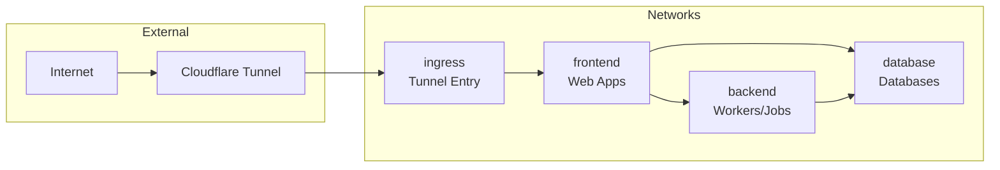
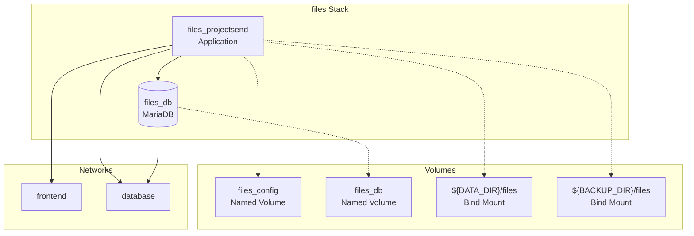

# Architecture

This document describes the high-level architecture of the Cothrom self-hosted stack.

## Overview

Cothrom uses a modular Docker Compose architecture where services are organized into logical "stacks" (e.g., files, data, calendar) that can be independently managed. All stacks are included into a root `compose.yml` file.

## Project Structure

```sh
cothrom/
├── compose.yml              # Root compose file with includes
├── .env                     # Environment variables
├── docker/                  # Stack definitions
│   ├── accounts.yml         # Akaunting accounting
│   ├── apps.yml            # Budibase low-code platform
│   ├── cal.yml             # Baikal calendar/contacts
│   ├── crm.yml             # Twenty CRM
│   ├── data.yml            # NocoDB + pgAdmin
│   ├── datastorage.yml     # Shared PostgreSQL databases
│   ├── documents.yml       # Etherpad collaborative editing
│   ├── draw.yml            # Excalidraw drawing tool
│   ├── files.yml           # ProjectSend file sharing
│   ├── grammar.yml         # LanguageTool grammar checking
│   ├── home.yml            # Dashy dashboard
│   ├── pdf.yml             # Stirling PDF tools
│   ├── pi.yml              # Glance monitoring dashboard
│   └── build/              # Custom Dockerfiles and configs
├── config/                  # Service configurations
│   ├── home/               # Dashy config
│   ├── pi_home/            # Glance config
│   └── pi_assets/          # Glance assets
└── docs/                    # Documentation (this directory)
```

## Networks

Cothrom uses four isolated Docker networks to segment services:



### Network Definitions

| Network | Purpose | Connected Services |
|---------|---------|-------------------|
| **ingress** | External access via Cloudflare tunnel | cloudflare-tunnel |
| **frontend** | Web applications and UI services | All app containers, Dashy, web servers |
| **backend** | Background workers and processing | Worker containers, cron jobs |
| **database** | Database services | PostgreSQL, MariaDB, MySQL, MongoDB, Redis |

## Compose Include System

The root `compose.yml` uses Docker Compose's `include` directive to load modular stack files:

```yaml
include:
  - path: ./docker/accounts.yml
  - path: ./docker/apps.yml
  - path: ./docker/cal.yml
  # ... more stacks
```

### Path Resolution

**Important:** Relative paths in included files resolve relative to the **included file's directory**, not the project root.

Example from `docker/home.yml`:
```yaml
volumes:
  - ../config/home/:/app/user-data/
```

This resolves as: `docker/../config/home/` → `config/home/` ✓

## Service Stack Pattern

Each stack typically includes:

1. **Application container(s)** - The main service
2. **Database container** - PostgreSQL, MySQL, or MongoDB
3. **Supporting services** - Redis cache, workers, etc.
4. **Volumes** - Named volumes for data, bind mounts for config
5. **Labels** - Metadata for backup policies and service classification

Example stack structure:



## Shared Resources

### YAML Anchors

The compose files use YAML anchors for reusable configurations:

```yaml
x-op-app-restart-policy: &app_restart_policy
  restart: unless-stopped

x-op-postgres-image: &post-image
  image: postgres:17-bookworm
```

Services reference these anchors to maintain consistency:

```yaml
services:
  myapp:
    <<: *app_restart_policy
    # ... other config
```

### Datastorage Stack

The `datastorage.yml` file provides shared PostgreSQL instances for multiple NocoDB workspaces. This is included by `data.yml` and provides isolated databases for different projects:

- `nocodb_data` - Main NocoDB metadata
- `nocodb_assdisaster_db` - Project-specific database
- `nocodb_fineopinion_db` - Project-specific database
- (and more...)

## External Access

Access to services is provided through:

1. **Cloudflare Tunnel** - Secure external access without opening firewall ports
2. **Direct Port Mapping** - Each service exposes a port on `localhost` for local access

Port ranges are defined in `.env`:
- `APPS_PORT=12101`
- `CAL_PORT=12103`
- `DATA_PORT=12104`
- etc.

## Data Storage Strategy

See [Paths and Volumes](configuration/paths-and-volumes.md) for details on the volume strategy.

Three types of storage are used:

1. **Named Docker Volumes** - Database data, app-internal config
2. **Bind Mounts (DATA_DIR)** - Application data accessible from host
3. **Bind Mounts (BACKUP_DIR)** - Backup storage
4. **Bind Mounts (config/)** - Editable configuration files

## Labels and Metadata

All containers are labeled with metadata for automation and documentation:

```yaml
labels:
  - io.cothrom.role="app"           # app | database | proxy | worker
  - io.cothrom.stack="files"        # Stack name
  - io.cothrom.data="true"          # Has persistent data
  - io.cothrom.data.class="config"  # database | files | config
  - io.cothrom.backup.policy="weekly"  # daily | weekly | monthly
```

See [Labels](configuration/labels.md) for the complete labeling scheme.

## Security Considerations

- Services are isolated by network segmentation
- Database credentials are provided via environment variables
- External access is only via Cloudflare tunnel (authenticated)
- Local access via localhost ports (requires server access)
- Secrets are stored in `.env` file (not committed to git)
